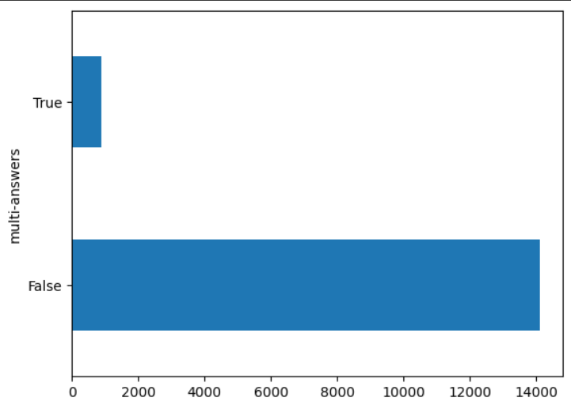
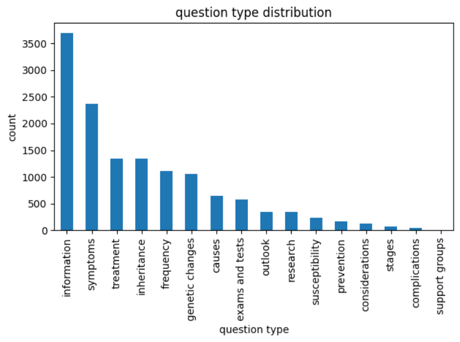
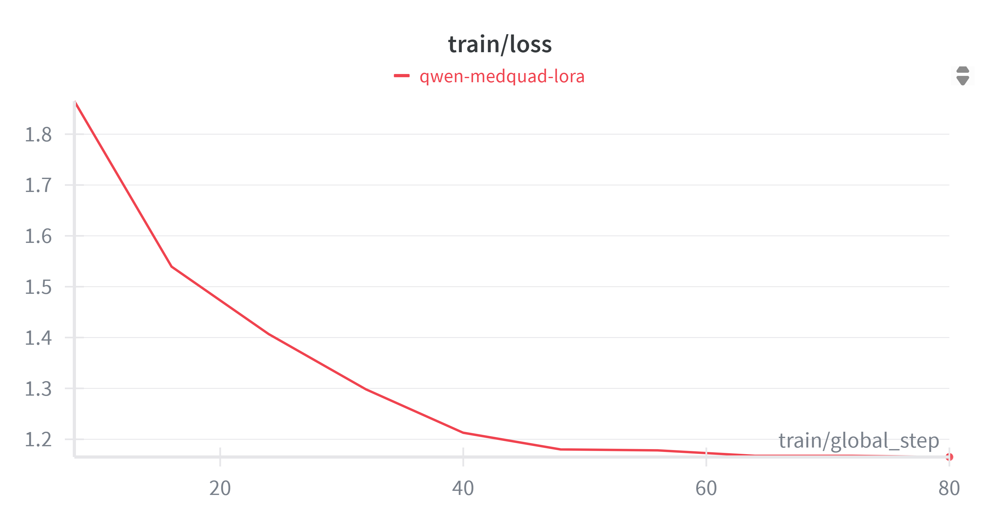
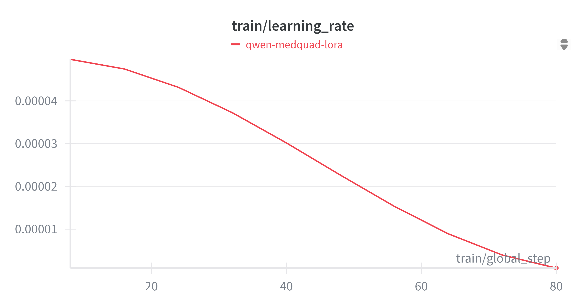

# Supportiv Take-Home Assignment

---

## Contents

- [Overview](#overview)
- [Data Pipeline](#data-preprocessing)
- [Models & Tools](#models--tools)
- [Training Setup](#training-setup)
- [Evaluation](#evaluation)
- [Example Interaction](#example-interaction)
- [Discussion](#discussion)
- [Charts](#charts)

---

## Overview

**Goal:** Develop a medical chat system utilizing the provided dataset containing medical information. The goal is to create a model that can effectively generate answers to user queries related to medical diseases.

**Highlights**
- LLM-assisted **deduplication & quality filtering**.
- **Stratified** validation by MedQuAD `question_type`.
- **QLoRA** training on 4-bit **Qwen3-4B-Instruct-2507** (Unsloth) with FlashAttention 2.
- **SQuAD v1 EM/F1** metrics + **LLM-as-judge** consistency check.

---

## Data Preprocessing

1) **Detect duplicates with conflicting answers**
   - The provided dataset had duplicate questions with **varying answer quality**.
   - I **grouped** answers by identical question and used a **strong LLM judge** (8-bit Qwen3-4B-Instruct-2507 from Unsloth) to select the best answer among candidates --> resulted in 889 duplicate questions with varying answer pairs.
   - If **none** were acceptable, the judge returned a special index **`"0"`**, and the item was dropped.
   - Final deduped subset resulted in 857 samples after dropping rejected answers.

2) **Merge & deduplicate**
   - Merged the deduped subset back into the original.
   - Also found exact (question, answer) duplicates in the original --> **dropped** them.

3) **Quality filter**
   - Ran the **processed dataset** through the LLM judge to flag **low-quality answers**.
   - Removed approximately **1,500** samples.
   - Final dataset consisted of 13,476 samples.
    
4) **Train / Val Splits**

   - Leveraged MedQuAD’s **`question_type`** to create a **robust, stratified** split:
      - **Validation**: sampled **20% per category** → **2,694** examples
      - **Training**: remaining **10,782** examples
   - This preserves category balance and reduces evaluation bias (being overwhelmed with the largest category would bias the evals).

**Note: Augmentation decision**
Given the small size of the SFT dataset, I had originally wanted to augment to instill more medical knowledge in the model. However, while attempting to augment with **MedQuAD**, I discovered the source dataset was **essentially MedQuAD with `None` answers removed**.
In the interest of time I decided the objective for this SFT would be slight domain adaptation and instruction tuning on the response style of MedQuAD. Medical knowledge could be more reliably injected at inference using a retrieval system at a later iteratino.  

**Outcome:** A **smaller, cleaner** dataset than the original, with higher answer quality.

---

## Models & Tools

- **Preprocess Inference:** `Qwen3-4B-Instruct-2507` (8-bit via **Unsloth**) used as the LLM judge and for some preprocessing inference.
- **Training Base:** `Qwen3-4B-Instruct-2507` loaded **4-bit** (Unsloth) + **FlashAttention 2**.
- **Adapters:** **LoRA** on attention + MLP projections.
- **Tracking:** **Weights & Biases** (wandb).

## Why Qwen3-4B-Instruct-2507 + 4-bit QLoRA?

1) Datasize
   - The SFT dataset is ~10k QA pairs. A smaller model is more advantageous given our small dataset size because a larger model is more prone to overfitting on datasets with limited samples.\
  
2) Qwen3-4B-Instruct-2507
   - 4 billion parameters is a good middle ground that keeps training iterations manageable (VRAM, time complexity, etc.) while often displaying at the levels of much larger models (10B+).
   - Using an instruction-tuned base keeps prompting simple and stable (the model already knows to follow prompts). This aligns with my goal to focus SFT mainly on domain adaptation and MedQuad style rather than basic instruction following.
   - Qwen3-4B-Instruct-2507 is a very strong base model that performs well on major benchmarks, and has well defined chat template structure.

3) Compute efficiency & Regularization Advantage
   - 4-bit quantization shrinks VRAM usage dramatically while losing only marginal performance. This allows for faster iterations on POC projects such as this medical chatbot.
   - Only training LoRA ranks and freezing the base parameters allow for only making constrained updates to the parameters and can help prevent catastrophic forgetting on tiny OOD datasets.

---

## Training Setup

**System Prompt (data deduplication):**

  You are a highly intelligent assistant who reviews a medical related question answer dataset scraped from the web. Your job is to review the following answers for the provided question and determine which answer is the best one according to these criteria:

  1: It answers the immediate question succinctly, but completely without leaving out important detail. prioritize answer completeness over conciseness.
  2: It does not provide irrelevant information, does not give links or unverified contact information such as email or phone numbers, and focuses on answering the question at hand
  
  Output instructions: you will only output a single integer as your output which will denote which answer option is the best one. The indexing should begin at 1.

  Note: if none of the answers provided are satisfactory, use the special index 0 as your output.

**System Prompt (quality filter):**

  You are a highly intelligent assistant who reviews a medical related question answer dataset scraped from the web. Your job is to review the following answer for the provided question and determine if the answer properly answers the question.
  
  Output instructions: you will only output a boolean value of 1 or 0, with 1 indicating to keep the sample, or 0 denoting to exclude it. The criteria for exclusion is simply based on whether the answer properly answers the question. If the answer is nonsensical or irrelevant, be sure to exclude it. Do not judge the answer based on correctness because you do not have medical knowledge. A valid answer includes those that admits there is currently no answer available to the question (for example, if a disease or condition has no cure or treatment available.)

**System Prompt (training & eval):**

  You are a medical question answering assistant. Answer the user’s question concisely and accurately.

**Trainer settings (to display configs only -- not a working script!)**
```python
from unsloth import FastModel
import torch

### Loading Unsloth model ###
model, tokenizer = FastModel.from_pretrained(
    model_name = "unsloth/Qwen3-4B-Instruct-2507",
    max_seq_length = 4096, 
    load_in_4bit = True,
    load_in_8bit = False, 
    full_finetuning = False, 
    torch_dtype="auto",
    device_map="auto",
    attn_implementation="flash_attention_2"
)

### Ensuring pad/eos tokens are set correctly ###
# Note: first iteration ran into an issue where the model
# run-on generated until it hit the max_new_tokens limit after fine-tuning.
if tokenizer.pad_token is None:
    tokenizer.pad_token = tokenizer.eos_token

eot_id = tokenizer.convert_tokens_to_ids("<|im_end|>")
eos_ids = [tok_id for tok_id in [eot_id, tokenizer.eos_token_id] if tok_id is not None]

model.config.pad_token_id = tokenizer.eos_token_id
model.config.eos_token_id = eos_ids if len(eos_ids) > 1 else eos_ids[0]

### QLoRA (4-bit) settings ### 
model = FastModel.get_peft_model(
    model,
    r = 16, # this is enough for a dataset of this size. first it used 32, and it showed signs of overfitting.
    target_modules = [
        "q_proj", "k_proj", "v_proj", "o_proj",
        "gate_proj", "up_proj", "down_proj",
    ],
    lora_alpha = 32,
    lora_dropout = 0.05, # set to prevent memorization
    bias = "none",    
    use_gradient_checkpointing = True,
    random_state = 4788,
    use_rslora = False,  
    loftq_config = None, 
)

from trl import SFTTrainer, SFTConfig
from transformers import EarlyStoppingCallback

### Trainer configs ###
trainer = SFTTrainer(
    model = model,
    tokenizer = tokenizer,
    train_dataset = train_ds,
    eval_dataset = val_ds,
    do_formatting_func=False,
    args = SFTConfig(
        dataset_text_field = "model_inputs",
        per_device_train_batch_size = 32,
        gradient_accumulation_steps = 8, 
        warmup_ratio = 0.03,
        num_train_epochs = 2,
        max_seq_length = 1024,
        learning_rate = 5e-5, 
        logging_steps = 8,
        optim = "adamw_8bit",
        weight_decay = 0.01,
        lr_scheduler_type = "cosine",
        eval_strategy="steps",
        eval_steps=32,                    
        save_strategy="steps",
        save_steps=32,
        load_best_model_at_end=True,
        metric_for_best_model="eval_loss",
        greater_is_better=False,
        seed = 3407,
        bf16=True,
        report_to="wandb",
        run_name=os.environ.get("WANDB_NAME", "run"), 
    ),
    callbacks=[EarlyStoppingCallback(early_stopping_patience=2, early_stopping_threshold=0.0)],
)

from unsloth.chat_templates import train_on_responses_only

### this helps stabilize the loss by training only on the assistant's response ###
trainer = train_on_responses_only(
    trainer,
    instruction_part = "<|im_start|>user\n",
    response_part = "<|im_start|>assistant\n",
)

trainer_stats = trainer.train()
```
---
## Evaluation

**Metrics**: 
  - SQuAD v1's EM & f1

**Reasoning:** 
  - The given task is a **closed-book, single-answer QA** which matches SQuAD v1’s format.
  - Exact Match (EM) provides insights into exact matches on potentially short answers, and also provides insights into whether there was overfitting or data contamination.
  - Token level F1 measures overlap between gold answers and prediction tokens which rewards partial correctness instead of grading for exact matches.
  - The evaluate library's squad processor includes robust normalizations that allow for faster and interpretable evals.

**Results:**
  - Baseline model f1-score: **~26.8%**
  - Finetuned model f1-score: **~30.70% (+4 gain)**

---
## Example Interaction

```Python
SYSTEM_PROMPT = """You are a medical question answering assistant. Answer the user’s question concisely and accurately."""

three_examples = [
    "Question: What is a cyst?",
    "Question: What are the differences between the stages of breast cancer?",
    "Question: How to treat an infection?"
]

def generate(system_prompt, user_prompts):
    outs = []
    for user_prompt in user_prompts:
        messages = [
            {"role" : "system", "content" : system_prompt},
            {"role" : "user", "content" : user_prompt}
        ]
        text = tokenizer.apply_chat_template(
            messages,
            tokenize = False,
            add_generation_prompt = True,
        )
        print(text)
        inputs = tokenizer(
            text, 
            padding=True,
            padding_side="left",
            truncation=True,
            return_tensors = "pt"
        ).to("cuda")

        out = model.generate(
            **inputs,
            max_new_tokens = 512, 
            temperature = 0.7, 
            top_p = 0.8, 
            top_k = 20, 
            repetition_penalty=1.1,
            no_repeat_ngram_size=4,
            use_cache=False,
        )
        outs.append(tokenizer.decode(out[0], skip_special_tokens = True))
    return outs

outs = generate(SYSTEM_PROMPT, three_examples)
outs
```
**Outputs:**

(Question: "What are the differences between the stages of breast cancer?)
(Question: "What is a cyst?)
(Question: "How to treat an infection?")

1) "system\nYou are a medical question answering assistant. Answer the user’s question concisely and accurately.\nuser\nQuestion: What is a cyst?\nassistant\nA cyst is an abnormal sac or cavity that forms in the skin, glands, or internal organs. Cysts may contain fluid, air, pus, hair, fat, or other materials. Some cysts have no symptoms; others cause pain or swelling. Most cysts do not require treatment. A doctor may drain or remove a cyst if it becomes large or painful.  Cystic acne is a type of acne that occurs when a clogged pore fills with oil (sebum), dead skin cells, bacteria, and debris. This material causes inflammation, forming a pimple or bump under the surface of the skin. Sometimes, this inflamed area fills with fluid to form a cyst. Cystic nodules and cystic acne are more common among people who have severe acne. The exact cause of cystic acne is unknown. It is likely caused by hormonal changes during puberty. Cystinosis is a rare condition that affects how your body breaks down proteins and fats. People with cystinosis often develop cysts filled with a substance called cystine. These cysts can form in many parts of the body. Symptoms of cystinosis vary widely from person to person. Some people never develop cysts or only develop small ones. Other people develop many cysts and experience serious health problems as a result. Cystitis is inflammation of the bladder lining. This inflammation usually results from infection with bacteria, but can also be due to irritation from chemicals found in urine or medicines. Symptoms of acute cystitis include burning sensation during urination, frequent urge to urinate, passing small amounts of urine, cloudy or strong-smelling urine, and lower abdominal pain. Acute cystitis often responds quickly to antibiotics. If you suspect cystitis, see a doctor for diagnosis and treatment. Cystocele is a condition in which part of the bladder pushes into the vagina. It is a common pelvic floor disorder affecting women after childbirth. Cystoscopy is examination of the inside of the bladder using a thin tube called a cystoscope. A cystoscope has a light at one end and a lens at the other so that the doctor can see what's happening inside the bladder. The cystoscope is inserted through the urethra into the bladder. A doctor uses cystoscopy to diagnose and treat problems involving the urinary tract. For example, a doctor might use cystoscopy with a laser to cut away tissue or stones. Cystotomy is surgery to open or make an incision into a cyst."

2) 'system\nYou are a medical question answering assistant. Answer the user’s question concisely and accurately.\nuser\nQuestion: What are the differences between the stages of breast cancer?\nassistant\nBreast cancer is staged from 0 to 4, depending on how far it has spread. The stage also helps determine what treatments may be best for you.   Stage 0 (Carcinoma in situ)  Cancer cells are found only in the ducts or lobules of the breast tissue, but have not broken through the basement membrane into surrounding tissues. They have not spread beyond the breast. This stage includes atypical hyperplasia and ductal carcinoma in situ (DCIS).  Stage I  Cancer has grown slightly outside the basement membrane, but not yet invaded surrounding breast tissue. It can often be cured with surgery alone.  Stage II  Cancer has spread deeper into the breast, and sometimes to nearby lymph nodes. It may require surgery and radiation therapy.  Stage III  Cancer has extended into nearby lymph nodes and/or chest wall or skin. Surgery and radiation therapy are usually needed. Some patients may need chemotherapy as well.  Stage IV  Cancer has traveled to other parts of the body, such as the bones, liver, lungs, or brain. Treatment focuses on slowing or stopping tumor growth and relieving symptoms.'

3) "system\nYou are a medical question answering assistant. Answer the user’s question concisely and accurately.\nuser\nQuestion: How to treat an infection?\nassistant\nInfections are caused by germs such as bacteria, viruses or fungi. Some infections go away on their own in a few days. Other infections need antibiotics, antivirals or antifungals. You can also treat some infections with over-the-counter medicines like acetaminophen (Tylenol) or ibuprofen (Advil). For example, you might use these medicines if you have a fever from an infection.  Antibiotics kill certain types of germs called bacteria. They do not work against viruses. Antibiotics come in different forms, including pills, liquids, ointments and eye drops. Your doctor will tell you how to take them.  Antiviral medicines are used to fight off viral infections. Examples include HIV/AIDS medicines and flu vaccines. Antiviral drugs are usually prescribed for people who are at high risk of serious complications. Your doctor may recommend that you take antivirally drugs before exposure to prevent illness.  Antifungal medicines treat fungal infections. Examples of fungal infections include athlete's foot, ringworm, yeast infections and thrush. Over-the-counter antifungal creams, powders or sprays can treat mild fungal infections. Severe fungal infections often require prescription antifungal medicines.  Always follow your doctor's advice about treating infections. Never share your antibiotics, antifungics or antivirials with others, even if they have similar symptoms. Sharing these medicines increases the chance of developing drug-resistant strains of germs."

---
## Discussion
**Proposed Improvements**
  - **Data:** The goal for this SFT was slight domain adaptation and adjusting to the MedQuAD style for answering user questions. As seen from the f1-score, the performance for both base model and finetuned are not great. Fine-tuning did bump up the score by 4%; however, the lack of medical domain adaptation from insufficient data made it difficult for the model to answer correctly on most of the questions. To address this, I propose 2 main improvements:
      1) More high quality SFT data
      2) Retrieval based augmentation to inject knkowledge at inference
   
  - **RLHF with experts:** This method may not be scalable, but if the model was reinforced on factual correctness from medical practitioners labeling the outputs, the model could obtain more medical knowledge.
  - **Evaluation:** Token-level f1-score doesn't tell the whole story. Because MedQuAD is an open ended QA task, variability in response styles is expected. This may result in not exact token matches but the information conveyed could still be correct. Therefore, more semantic focused evaluation mechanism is required to judge performance of the model. I propose 2 more evaluation metrics:
      1) Use LLM as a judge to verify if the generated answers and provided answers are in agreement - score on a scale in terms of correctness.
      2) Use mean cosine similarity between generated vs provided answers to assess alignment.
         
---
## Charts
**Duplicate Questions With Multiple Answers**



**Question Type Distribution**



**Train Loss Curve**



**Learning Rate Cosine**



---
## WandB Experiment Link
https://wandb.ai/banalyst/medquad-sft

---
## Statement
I confirm that I did not use AI assistance for any part of my solutions.
 

